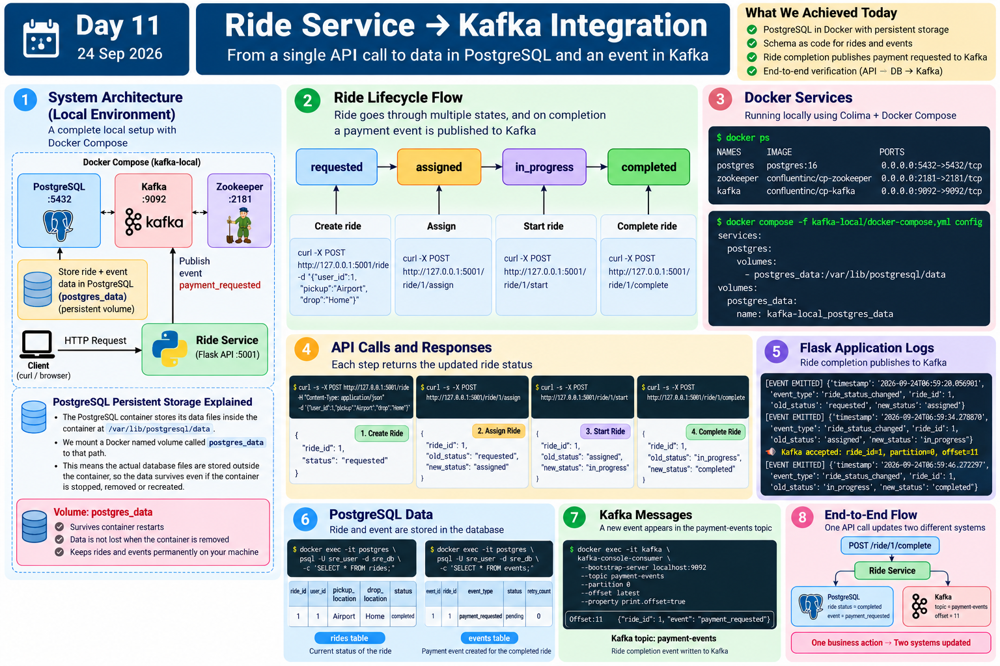

# Day 11 - Ride Service -> Kafka Integration

> **Date:** 24 September 2026
> **Status:** End-to-end path verified
> **Branch:** `feature/day11-kafka-consumer-state`

Day 11 connects the real Ride Service to Kafka and makes the local data layer reproducible.

A ride can now move through its lifecycle, persist state in PostgreSQL, and automatically publish a `payment_requested` event to Kafka when the ride reaches `completed`.



## What changed

| Area | Before | After |
|---|---|---|
| PostgreSQL | Depended on a deleted Ubuntu VM | Runs locally in Docker Compose |
| Database storage | Tied to an old VM | Named Docker volume `postgres_data` |
| Database schema | Existed only in the previous runtime | Stored as `services/ride-service/schema.sql` |
| Kafka producer | Infinite demo loop sending fake `ride_id=101` | Reusable `publish_payment_requested(ride_id)` function |
| Ride completion | Updated PostgreSQL only | Updates PostgreSQL **and** publishes to Kafka |
| Verification | Components tested separately | Full API -> DB -> Kafka flow verified |

## End-to-end flow

```text
Client
  |
  | HTTP
  v
Ride Service (Flask :5001)
  |
  |---> PostgreSQL (:5432)
  |       |-- rides table
  |       `-- events table
  |
  `---> Kafka Producer
          |
          v
      payment-events
          |
          v
      Partition 0
```

A real ride was tested through:

```text
requested -> assigned -> in_progress -> completed
```

When `ride_id=1` reached `completed`, Kafka acknowledged:

```text
partition=0, offset=11
```

The record was independently read back from Kafka:

```json
{"ride_id": 1, "event": "payment_requested"}
```

## Verified state

### PostgreSQL - rides

```text
ride_id | user_id | pickup_location | drop_location | status
--------+---------+-----------------+---------------+----------
1       | 1       | Airport         | Home          | completed
```

### PostgreSQL - events

```text
event_id | ride_id | event_type         | status  | retry_count
---------+---------+--------------------+---------+------------
1        | 1       | payment_requested  | pending | 0
```

### Kafka

```text
Topic: payment-events
Partition: 0
Offset: 11
Value: {"ride_id": 1, "event": "payment_requested"}
```

## Local services

| Service | Port | Purpose |
|---|---:|---|
| Ride Service | `5001` | HTTP API |
| PostgreSQL | `5432` | Durable application state |
| Kafka | `9092` | Event log / streaming |
| ZooKeeper | `2181` | Coordination for this Kafka 7.5 lab |

## How to resume this lab

### 1. Start Colima

```bash
colima start
```

### 2. Start infrastructure

```bash
cd ~/sre-uber-system

docker compose -f kafka-local/docker-compose.yml up -d
```

### 3. Verify PostgreSQL is ready

```bash
docker exec postgres \
  pg_isready \
  -U sre_user \
  -d sre_db
```

Expected:

```text
/var/run/postgresql:5432 - accepting connections
```

### 4. Verify schema

```bash
docker exec -it postgres \
  psql -U sre_user -d sre_db \
  -c '\dt'
```

Expected tables:

```text
rides
events
```

> On a brand-new PostgreSQL volume, initialize the schema once with:
>
> ```bash
> docker exec -i postgres \
>   psql -U sre_user -d sre_db \
>   < services/ride-service/schema.sql
> ```

### 5. Start the Ride Service

```bash
cd ~/sre-uber-system/services/ride-service
source ~/.venvs/sre-uber-system/bin/activate
python3 app.py
```

### 6. Watch new Kafka events

```bash
docker exec -it kafka \
  kafka-console-consumer \
  --bootstrap-server localhost:9092 \
  --topic payment-events \
  --partition 0 \
  --offset latest \
  --property print.offset=true
```

### 7. Create and complete a ride

```bash
curl -s -X POST http://127.0.0.1:5001/ride \
  -H 'Content-Type: application/json' \
  -d '{"user_id":1,"pickup":"Airport","drop":"Home"}'
```

Use the returned ride ID:

```bash
curl -s -X POST http://127.0.0.1:5001/ride/<ride_id>/assign
curl -s -X POST http://127.0.0.1:5001/ride/<ride_id>/start
curl -s -X POST http://127.0.0.1:5001/ride/<ride_id>/complete
```

The final request should cause a new `payment_requested` record to appear in Kafka.

## Important design limitation discovered

Ride completion currently performs two independent writes:

```text
Ride completion
      |
      +----> PostgreSQL
      |
      `----> Kafka
```

These writes are **not atomic**.

A future failure such as:

```text
PostgreSQL succeeds
Kafka publish fails
```

can leave the system in inconsistent state.

We are intentionally keeping this design for the next lab so we can reproduce the failure and understand why patterns such as the **Transactional Outbox** exist.

## Documentation map

- [`summary.md`](./summary.md) - what was built and verified
- [`learnings.md`](./learnings.md) - concepts and mental models
- [`failures.md`](./failures.md) - incidents, evidence, root causes, fixes
- [`decisions.md`](./decisions.md) - architecture decisions and trade-offs

## Next mission

> **Break Kafka while PostgreSQL remains healthy, complete another ride, and observe what partial success looks like in a distributed system.**

That experiment will lead into dual-write consistency, retries, and the transactional outbox pattern.
